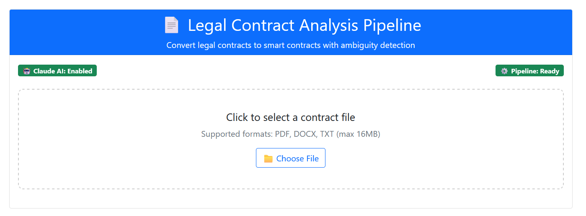
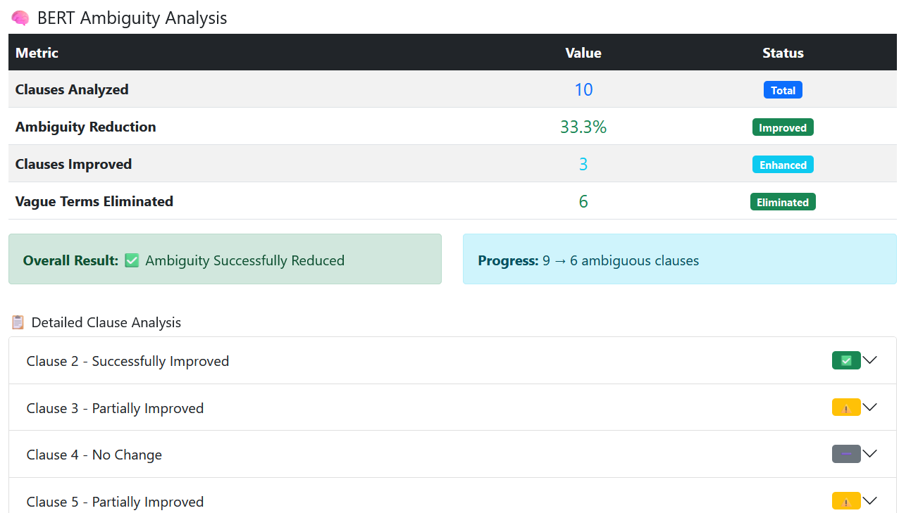
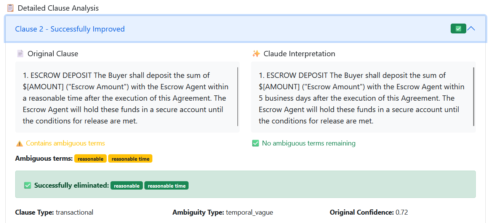

### Instructions

```bash
git clone https://github.com/cthomas5-csus/MastersProject
cd MastersProject
```

```bash
python -m venv venv
source venv/bin/activate # Windows users: venv\Scripts\activate
```

```bash
pip install -r requirements.txt
python -m spacy download en_core_web_sm
```

```bash
cp .env.example .env
```

Generate a secret key:
```bash
python -c "import secrets; print(secrets.token_hex(32))"
```

Put the output into the .env's SECRET_KEY.

### Running the Application

```bash
python app.py
```

The application can be accessed via web browser at http://localhost:5000

Upload a contract such as a PDF, DOCX or TXT and the application interface will display:
- All transactional clauses are pulled out and listed
- Ambiguity scores for each of these clauses
- A generated Solidity smart contract







### Incorporating AI Disambiguation

To enable AI disambiguation with the Claude API you can supply your Claude API key as an environment variable in your .env file:
```env
CLAUDE_API_KEY=your-api-key-here
```

Restart the app and it will use Claude Sonnet 4.5 to generate less ambiguous clause interpretations.

The app maintains the same core functionality without this feature, but AI-powered disambiguation produces clearer, more acceptable, and more enforceable clauses.

### Training the Transactional Clause Classifier

The transactional clause classifier, which is not included in this repository because of the size of the model, can be trained with:
```bash
python train_legalbert.py
```

By default, it is trained on ./dataset/legalbert_training_data.json as a synthetic dataset generated by Claude 3 Opus.

Additional custom synthetic training data can also be generated with:
```bash
python generate_training_dataset.py  # needs Claude API key
```

The model can then be retrained by running train_legalbert.py using the newly generated data

The trained model gives better transactional clause detection.


### Required Environment Variables
- SECRET_KEY - Flask needs this (required)
- CLAUDE_API_KEY - AI features become enabled (Optional)
- LOG_LEVEL - INFO, DEBUG, or WARNING (default: INFO)
- PORT - Run on this port (default: 5000)

### Feature Summary
- Extracts clauses out of legal contracts
- Uses ML to identify transactional clauses
- Scores how ambiguous each clause is
- Generates Solidity smart contracts

Example contracts can be found inside the sample_contracts/ directory.


The fine-tuned transactional clause classifier is not included due to file size. In the absence of this model in the filesystem, the application reverts to rule-based transactional clause classification by default. For better accuracy, the transactional clause classifier can be trained with the above instructions and existing dataset.
